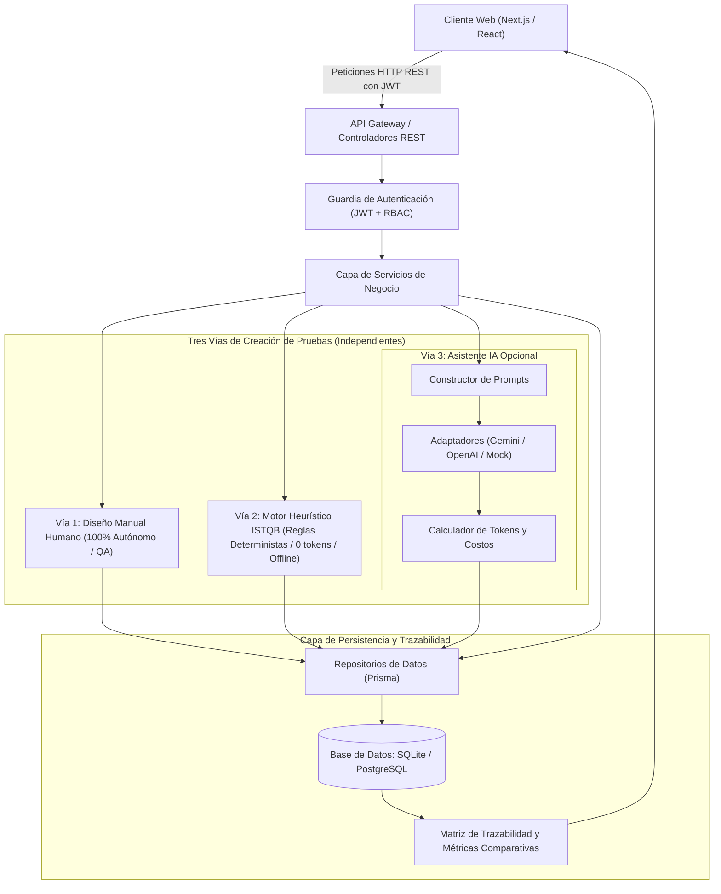
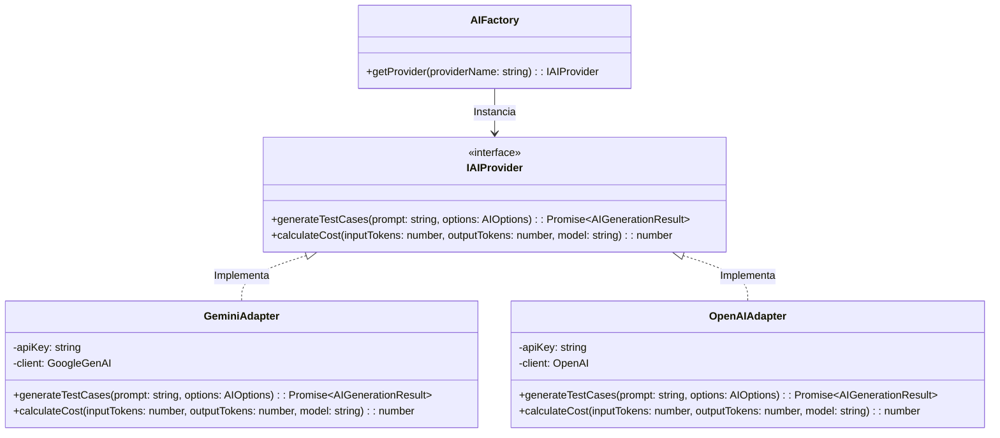
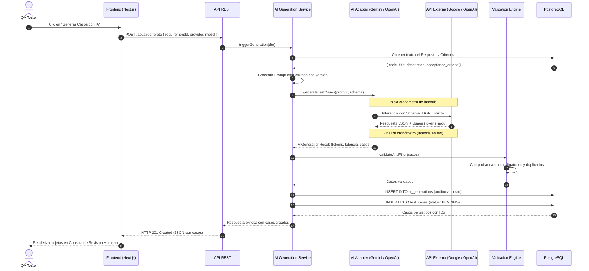

# Arquitectura Técnica y Diseño de Software — TestGenAI

**Sistema:** TestGenAI  
**Versión:** 1.1.0  
**Fecha:** Septiembre 2026  
**Propósito:** Especificar los patrones arquitectónicos, el flujo de datos y los contratos de integración del sistema.

> **Novedades v1.1 (endurecimiento):** ver [MEJORAS_IMPLEMENTADAS.md](./MEJORAS_IMPLEMENTADAS.md) para el detalle de las 40 mejoras.

---

## 0. Capas transversales (v1.1)

El pipeline de cada petición atraviesa middlewares transversales antes de llegar al controlador:

```
Request
  → helmet (cabeceras de seguridad)
  → compression (gzip)
  → CORS (allowlist CORS_ORIGINS)
  → express.json (límite 10mb)
  → requestId (X-Request-Id)
  → pino-http (logging estructurado con latencia)
  → rate-limit (por zona: auth / ai / general)
  → [/api/v1] authenticateJWT → asyncHandler → guard de propiedad → controlador
  → capa de servicios (lógica pura)
  → Prisma (BD)
  ← errorHandler central (traduce ApiError / ZodError / Prisma a HTTP seguro)
```

- **Validación de entorno** (`config/env.ts`): Zod valida y congela la configuración en el arranque; el proceso no inicia si algo crítico falta o es inseguro en producción.
- **Autorización a nivel de recurso** (`utils/ownership.ts`): previene IDOR verificando la cadena proyecto→requisito→caso contra el usuario autenticado.
- **Resiliencia de IA** (`utils/retry.ts`): timeout + reintentos con backoff; si el proveedor falla, cae al motor heurístico determinista.
- **Observabilidad**: `pino` estructurado + `X-Request-Id` + canal de auditoría (`utils/audit.ts`).

---

## 1. Visión General de la Arquitectura

TestGenAI sigue un patrón arquitectónico **Cliente–Servidor Desacoplado** basado en principios de **Clean Architecture (Arquitectura Limpia / Hexagonal)**. El backend opera como un servicio de dominio y orquestación que desacopla la persistencia de datos y la inferencia de Inteligencia Artificial mediante abstracciones e interfaces.



---

## 2. Capas del Sistema y Responsabilidades

### 2.1 Capa de Presentación (Frontend)
- **Tecnología:** Next.js / React con TypeScript.
- **Responsabilidad:** Renderizado de vistas reactivas, gestión del estado del usuario en el navegador, validación de formularios en el cliente y presentación de gráficos de cobertura y costos.
- **Comunicación:** Exclusivamente a través de llamadas asíncronas HTTP/REST con formato JSON hacia los endpoints de la API.

### 2.2 Capa de Aplicación / Controladores (Backend Entrypoint)
- **Responsabilidad:** 
  - Exposición de endpoints REST normalizados.
  - Validación de DTOs de entrada mediante esquemas estrictos (`class-validator` / `Pydantic`).
  - Extracción y verificación del token JWT del encabezado `Authorization`.
  - Transformación de excepciones en códigos de estado HTTP semánticos (400, 401, 403, 404, 500).

### 2.3 Capa de Dominio y Servicios
- **Responsabilidad:** 
  - Reglas de negocio puras (aprobación obligatoria de casos, cálculo de métricas ISTQB, cambio de versión de requisitos).
  - Orquestación entre el repositorio de datos y el motor de IA.

### 2.4 Capa de Infraestructura y Adaptadores
- **Responsabilidad:** 
  - Conexión a la base de datos PostgreSQL mediante un ORM o pool de conexiones.
  - Comunicación con APIs externas de LLMs (Google Gemini / OpenAI) implementando el **Patrón Adaptador**.

---

## 3. Patrón Adaptador para Proveedores de IA (*AI Provider Adapter*)

Para garantizar que el sistema no dependa rígidamente de un único proveedor y para permitir la comparación experimental de modelos exigida en la tesis, la interacción con los LLM se diseña mediante una interfaz común:



### 3.1 Contrato de Entrada/Salida Estandarizado

Cualquiera sea el proveedor utilizado (Gemini o OpenAI), la respuesta devuelta a la capa de servicio debe cumplir el siguiente contrato unificado:

```typescript
export interface AIGenerationResult {
  requirementId: string;
  provider: 'gemini' | 'openai';
  model: string;
  promptVersion: string;
  inputTokens: number;
  outputTokens: number;
  latencyMs: number;
  estimatedCostUsd: number;
  cases: RawGeneratedCase[];
  rawResponse: string;
}

export interface RawGeneratedCase {
  type: 'positive' | 'negative' | 'alternative' | 'boundary' | 'validation';
  title: string;
  preconditions: string[];
  steps: string[];
  testData?: string;
  expectedResult: string;
  priority: 'high' | 'medium' | 'low';
  evidenceStatus: 'derived' | 'suggested' | 'ambiguous' | 'conflict';
  evidenceText: string;
}
```

---

## 4. Flujo de Datos Detallado de una Generación



---

## 5. Control de Alucinaciones y Reglas del Validador

Para mitigar el riesgo de invención de reglas no justificadas por el requisito, el sistema aplica un filtro en tres fases:

1. **Fase 1 (A nivel de Prompt):** Instrucción negativa explícita: *"No conviertas supuestos en hechos. Si un paso no está sustentado en el requisito, debes clasificar evidence_status como 'suggested' y justificarlo en evidence_text"*.
2. **Fase 2 (Validación Sintáctica y Estructural):** El validador descarta o marca como defectuoso cualquier caso que omita precondiciones, pasos o resultado esperado.
3. **Fase 3 (Revisión Humana Obligatoria):** Casos con estado `suggested` o `ambiguous` muestran una alerta visual amarilla en el frontend, exigiendo al QA confirmación antes de permitir su aprobación.

---

## 6. Seguridad y Consideraciones Operativas

- **Protección de API Keys:** Gestionadas estrictamente en el entorno del servidor (`.env`). Nunca se inyectan en variables con prefijo `NEXT_PUBLIC_`.
- **CORS y Rate Limiting:** La API backend implementa limitación de peticiones por IP y usuario para prevenir abusos o consumo descontrolado de tokens de IA.
- **Transaccionalidad en BD:** La inserción del registro de auditoría (`ai_generations`) y los casos de prueba generados (`test_cases`) se ejecutan dentro de una transacción SQL atómica (`BEGIN ... COMMIT`). Si falla la persistencia de un caso, se hace rollback para evitar inconsistencias.
