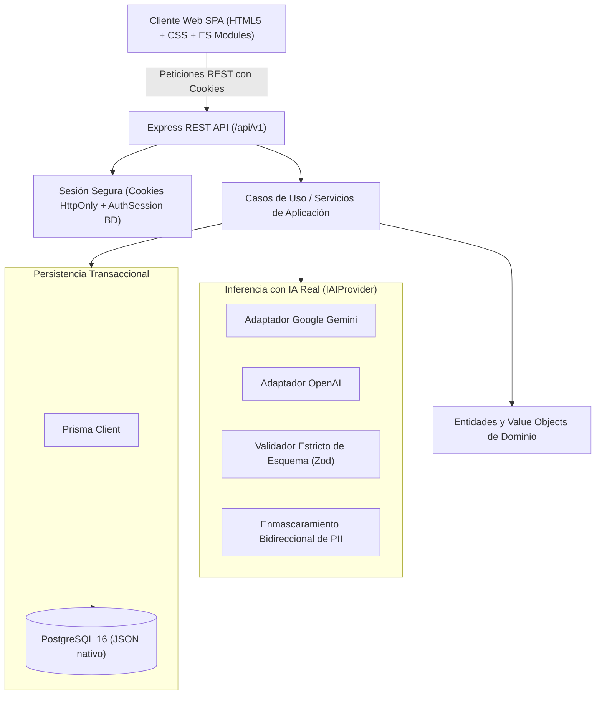

# Arquitectura Técnica y Diseño de Software — TestGenAI MVP Real

**Sistema:** TestGenAI  
**Versión:** 1.0 (MVP Real Consolidado)  
**Fecha:** Octubre 2026  
**Propósito:** Especificar los patrones arquitectónicos, el flujo de datos, los componentes y contratos del sistema consolidado.

---

## 1. Visión General de la Arquitectura

TestGenAI implementa una arquitectura **Monolito Modular por Capas** basada en principios de **Arquitectura Hexagonal (Puertos y Adaptadores)**. Se desacoplan el dominio, la persistencia en PostgreSQL y la inferencia con modelos de lenguaje fundacionales (Google Gemini y OpenAI).



---

## 2. Decisiones de Diseño y Pila Tecnológica

| Capa | Componente | Decisión Técnica |
|---|---|---|
| **Presentación** | Frontend SPA | HTML5 semántico, CSS moderno y JavaScript modular nativo (ES Modules). No utiliza frameworks frontend pesados. |
| **API** | Node.js + Express + TypeScript | Rutas REST unificadas bajo el prefijo `/api/v1`, compresión gzip, cabeceras seguras con Helmet y rate-limiting por zonas. |
| **Dominio y Aplicación** | Casos de Uso | `GenerateTestCasesUseCase`, `ReviewTestCaseUseCase`, entidades ricas (`TestCaseEntity`, `RequirementEntity`), value objects (`TestCaseCode`, `ISTQBTechnique`, etc.). |
| **Persistencia** | PostgreSQL 16 + Prisma ORM | Esquema relacional con soporte nativo de tipos `Json` para precondiciones, pasos y snapshots de auditoría. Soporte exclusivo de PostgreSQL. |
| **Integración IA** | Puertos y Adaptadores | Interfaz `IAIProvider` implementada exclusivamente por adaptadores reales: `GeminiAdapter` y `OpenAIAdapter`. Sin adaptadores mock ni generadores de sustitución. |
| **Sesión** | Cookies HttpOnly + JWT | Access token corto (1h) en cookie HttpOnly; Refresh token (7d) persistido en la tabla `AuthSession` con rotación atómica y revocación efectiva en logout. |

---

## 3. Pipeline de Procesamiento de Solicitudes

Cada petición HTTP atraviesa un pipeline ordenado de middlewares:

```
Request HTTP
  → helmet (cabeceras de seguridad CSP, XSS, nosniff)
  → compression (compresión gzip/deflate)
  → CORS (allowlist estricta basada en CORS_ORIGINS)
  → cookie-parser (lectura de cookies HttpOnly)
  → express.json (límite máximo 10MB)
  → requestId (identificador único X-Request-Id)
  → pino-http (registro estructurado de logs y latencia)
  → rate-limit (limitación de tasa por IP/ruta)
  → verifyCsrfToken (comprobación de Origin/Referer en mutaciones autenticadas)
  → authenticateJWT (validación de access token con recuperación desde cookie o cabecera)
  → Ownership & RBAC Guard (comprobación de propiedad proyecto → requisito → caso)
  → Controlador REST (/api/v1)
  → Caso de Uso / Servicio de Aplicación
  → Persistencia / Proveedor IA
  ← errorHandler central (transforma errores a formato estándar { success: false, message })
```

---

## 4. Flujo Unificado de Generación de Casos (RF-04 / RF-05)

1. **Autorización y Validación:** Verificación de rol y pertenencia del proyecto/requisito.
2. **Captura de Snapshot:** Registro de la versión exacta del requisito (`RequirementVersion`) enviado al modelo.
3. **Guardrails de Seguridad:**
   - Detección preventiva de inyección de prompt con `PromptGuard`.
   - Enmascaramiento reversible de datos personales sensibles (PII) en título, descripción y criterios mediante `PIIMasker`.
4. **Verificación de Caché:** Consulta canónica basada en huella SHA-256 (proveedor, modelo, versión de requisito, prompt).
5. **Invocación del Proveedor Real:** Llamada asíncrona a Gemini u OpenAI con timeout configurado y un único reintento para errores transitorios HTTP (respetando `Retry-After`).
6. **Validación Estricta:** Validación del JSON devuelto mediante esquema Zod (`AITestCasesOutputSchema`). Si la respuesta no cumple la estructura o está vacía, la generación se marca como fallida (error 502/503).
7. **Desenmascaramiento:** Restauración segura de los tokens de PII antes de persistir.
8. **Persistencia Transaccional:**
   - Registro de la ejecución en `AiGeneration` con tokens informados, latencia y costo real.
   - Guardado de casos en estado `PENDING` asociados a la `AiGeneration` y al `Requirement`.
   - Asignación atómica de códigos correlativos `CP-XXX`.
9. **Detección de Calidad:** Ejecución de detectores de advertencia (ambigüedad RF-13 y duplicados RF-14) informados al usuario sin alterar datos.

---

## 5. Flujo de Auditoría Humana y Revisión (RF-06 / RF-08)

El sistema impone un ciclo de auditoría humana estricto:

- **Revisión Individual:** Cada caso se revisa, edita, aprueba o rechaza individualmente.
- **Control de Concurrencia Optimista:** La mutación exige `expectedVersion`; si el caso fue editado concurrentemente, se rechaza con código HTTP 409.
- **Transacción Atómica de Revisión:** La actualización del caso y la creación del registro inmutable en `TestCaseReview` ocurren en la misma transacción de base de datos.
- **Snapshots de Auditoría:** `TestCaseReview` almacena el estado completo previo (`previousContent`) y posterior (`newContent`).
- **Reglas de Decisión:**
   - Rechazar un caso requiere ingresar obligatoriamente el motivo del rechazo.
   - Aprobar un caso con estado de evidencia `conflict` requiere justificación técnica explícita.
- **Preservación Histórica:** La regeneración de casos crea nuevas instancias y generaciones sin sobreescribir casos ni revisiones previas.
