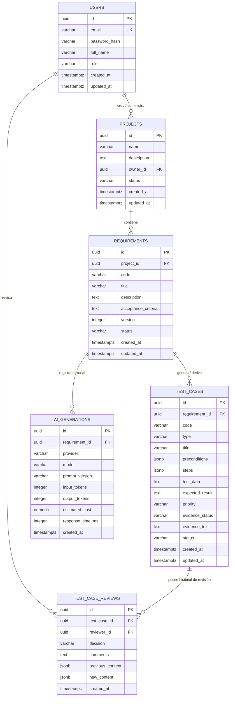

# Modelo de Datos y Esquema Relacional — TestGenAI

**Motor de Base de Datos:** PostgreSQL 15+  
**Versión del Esquema:** 1.0.0  
**Fecha:** Septiembre 2026  

---

## 1. Diagrama Entidad-Relación (ERD)



---

## 2. Diccionario de Datos

### 2.1 Tabla `users`
Almacena las cuentas de usuario y credenciales de acceso al sistema.

| Columna | Tipo | Nulo | Descripción / Restricción |
|---|---|---|---|
| `id` | `UUID` | No | Clave primaria autogenerada (`gen_random_uuid()`). |
| `email` | `VARCHAR(255)` | No | Correo electrónico único del usuario. |
| `password_hash` | `VARCHAR(255)` | No | Contraseña cifrada con algoritmo seguro (bcrypt/argon2). |
| `full_name` | `VARCHAR(150)` | No | Nombre completo del usuario. |
| `role` | `VARCHAR(50)` | No | Rol asignado: `'QA_TESTER'`, `'QA_LEAD'`, `'DEVELOPER'`, `'ADMIN'`. |
| `created_at` | `TIMESTAMPTZ` | No | Fecha y hora de registro. |
| `updated_at` | `TIMESTAMPTZ` | No | Fecha de última actualización. |

### 2.2 Tabla `projects`
Agrupa los requerimientos y el conjunto de pruebas bajo un mismo software o producto.

| Columna | Tipo | Nulo | Descripción / Restricción |
|---|---|---|---|
| `id` | `UUID` | No | Clave primaria autogenerada. |
| `name` | `VARCHAR(150)` | No | Nombre del proyecto de software. |
| `description` | `TEXT` | Sí | Alcance u objetivo general del proyecto. |
| `owner_id` | `UUID` | No | Clave foránea referenciando a `users(id)`. |
| `status` | `VARCHAR(30)` | No | Estado: `'ACTIVE'`, `'ARCHIVED'`. Default `'ACTIVE'`. |
| `created_at` | `TIMESTAMPTZ` | No | Timestamp de creación. |
| `updated_at` | `TIMESTAMPTZ` | No | Timestamp de modificación. |

### 2.3 Tabla `requirements`
Contiene los requisitos funcionales, historias de usuario y criterios de aceptación base.

| Columna | Tipo | Nulo | Descripción / Restricción |
|---|---|---|---|
| `id` | `UUID` | No | Clave primaria autogenerada. |
| `project_id` | `UUID` | No | Clave foránea referenciando a `projects(id)` ON DELETE CASCADE. |
| `code` | `VARCHAR(50)` | No | Código visible único por proyecto (ej. `'REQ-001'`). |
| `title` | `VARCHAR(255)` | No | Título conciso del requisito. |
| `description` | `TEXT` | No | Descripción en lenguaje natural / Historia de usuario. |
| `acceptance_criteria` | `TEXT` | No | Criterios de aceptación (Gherkin o lista estructurada). |
| `version` | `INTEGER` | No | Número de versión incremental (Default `1`). |
| `status` | `VARCHAR(50)` | No | Estado: `'DRAFT'`, `'READY_FOR_AI'`, `'GENERATED'`, `'OBSOLETE'`. |
| `created_at` | `TIMESTAMPTZ` | No | Timestamp de registro. |
| `updated_at` | `TIMESTAMPTZ` | No | Timestamp de última edición del requisito. |

### 2.4 Tabla `test_cases`
Casos de prueba individuales derivados de un requisito.

| Columna | Tipo | Nulo | Descripción / Restricción |
|---|---|---|---|
| `id` | `UUID` | No | Clave primaria autogenerada. |
| `requirement_id` | `UUID` | No | Clave foránea a `requirements(id)` ON DELETE CASCADE. |
| `code` | `VARCHAR(50)` | No | Código correlativo (ej. `'CP-001'`). |
| `type` | `VARCHAR(30)` | No | `'positive'`, `'negative'`, `'alternative'`, `'boundary'`, `'validation'`. |
| `title` | `VARCHAR(255)` | No | Título claro del escenario de prueba. |
| `preconditions` | `JSONB` | No | Arreglo JSON con lista de condiciones previas. |
| `steps` | `JSONB` | No | Arreglo JSON ordenado con los pasos de ejecución. |
| `test_data` | `TEXT` | Sí | Datos concretos sugeridos para la ejecución. |
| `expected_result` | `TEXT` | No | Resultado esperado verificable. |
| `priority` | `VARCHAR(20)` | No | `'high'`, `'medium'`, `'low'`. |
| `evidence_status` | `VARCHAR(30)` | No | `'derived'`, `'suggested'`, `'ambiguous'`, `'conflict'`. |
| `evidence_text` | `TEXT` | Sí | Cita textual del requisito que sustenta la prueba. |
| `source` | `VARCHAR(30)` | No | Origen: `'MANUAL'`, `'RULE_BASED'`, `'AI_GENERATED'`. Default `'MANUAL'`. |
| `status` | `VARCHAR(30)` | No | Estado de revisión: `'PENDING'`, `'APPROVED'`, `'MODIFIED'`, `'REJECTED'`. |
| `created_at` | `TIMESTAMPTZ` | No | Timestamp de creación. |
| `updated_at` | `TIMESTAMPTZ` | No | Timestamp de última actualización. |

### 2.5 Tabla `ai_generations`
Auditoría y registro métrico de cada llamada efectuada a un proveedor LLM.

| Columna | Tipo | Nulo | Descripción / Restricción |
|---|---|---|---|
| `id` | `UUID` | No | Clave primaria autogenerada. |
| `requirement_id` | `UUID` | No | Clave foránea a `requirements(id)`. |
| `provider` | `VARCHAR(50)` | No | Proveedor utilizado (ej. `'gemini'`, `'openai'`). |
| `model` | `VARCHAR(100)` | No | Modelo específico (ej. `'gemini-2.5-flash-lite'`). |
| `prompt_version` | `VARCHAR(20)` | No | Versión del template de prompt (ej. `'v1.0'`). |
| `input_tokens` | `INTEGER` | No | Cantidad de tokens consumidos en el prompt. |
| `output_tokens` | `INTEGER` | No | Cantidad de tokens generados en la respuesta. |
| `estimated_cost` | `NUMERIC(10, 6)` | No | Costo monetario calculado en USD. |
| `response_time_ms` | `INTEGER` | No | Latencia total de la llamada en milisegundos. |
| `input_hash` | `VARCHAR(64)` | Sí | **(v1.1)** Hash SHA-256 de las entradas del prompt; habilita la caché de generaciones (evita costo por peticiones idénticas). |
| `created_at` | `TIMESTAMPTZ` | No | Timestamp de la ejecución. |

### 2.6 Tabla `test_case_reviews`
Historial de decisiones humanas tomadas sobre cada caso de prueba (*Human-in-the-Loop*).

| Columna | Tipo | Nulo | Descripción / Restricción |
|---|---|---|---|
| `id` | `UUID` | No | Clave primaria autogenerada. |
| `test_case_id` | `UUID` | No | Clave foránea a `test_cases(id)` ON DELETE CASCADE. |
| `reviewer_id` | `UUID` | No | Clave foránea a `users(id)`. |
| `decision` | `VARCHAR(30)` | No | Decisión: `'APPROVED'`, `'MODIFIED'`, `'REJECTED'`. |
| `comments` | `TEXT` | Sí | Justificación o notas del revisor humano. |
| `previous_content`| `JSONB` | Sí | Instantánea del caso antes del cambio. |
| `new_content` | `JSONB` | Sí | Instantánea del caso después del cambio. |
| `created_at` | `TIMESTAMPTZ` | No | Timestamp de la acción de revisión. |

---

## 3. Script DDL de Creación para PostgreSQL (`init.sql`)

```sql
-- Habilitar extensión para generación de UUIDs criptográficos
CREATE EXTENSION IF NOT EXISTS "uuid-ossp";

-- 1. Tabla de Usuarios
CREATE TABLE IF NOT EXISTS users (
    id UUID PRIMARY KEY DEFAULT uuid_generate_v4(),
    email VARCHAR(255) UNIQUE NOT NULL,
    password_hash VARCHAR(255) NOT NULL,
    full_name VARCHAR(150) NOT NULL,
    role VARCHAR(50) NOT NULL CHECK (role IN ('QA_TESTER', 'QA_LEAD', 'DEVELOPER', 'ADMIN')),
    created_at TIMESTAMPTZ NOT NULL DEFAULT CURRENT_TIMESTAMP,
    updated_at TIMESTAMPTZ NOT NULL DEFAULT CURRENT_TIMESTAMP
);

-- 2. Tabla de Proyectos
CREATE TABLE IF NOT EXISTS projects (
    id UUID PRIMARY KEY DEFAULT uuid_generate_v4(),
    name VARCHAR(150) NOT NULL,
    description TEXT,
    owner_id UUID NOT NULL REFERENCES users(id) ON DELETE RESTRICT,
    status VARCHAR(30) NOT NULL DEFAULT 'ACTIVE' CHECK (status IN ('ACTIVE', 'ARCHIVED')),
    created_at TIMESTAMPTZ NOT NULL DEFAULT CURRENT_TIMESTAMP,
    updated_at TIMESTAMPTZ NOT NULL DEFAULT CURRENT_TIMESTAMP
);

-- 3. Tabla de Requisitos
CREATE TABLE IF NOT EXISTS requirements (
    id UUID PRIMARY KEY DEFAULT uuid_generate_v4(),
    project_id UUID NOT NULL REFERENCES projects(id) ON DELETE CASCADE,
    code VARCHAR(50) NOT NULL,
    title VARCHAR(255) NOT NULL,
    description TEXT NOT NULL,
    acceptance_criteria TEXT NOT NULL,
    version INTEGER NOT NULL DEFAULT 1,
    status VARCHAR(50) NOT NULL DEFAULT 'DRAFT' CHECK (status IN ('DRAFT', 'READY_FOR_AI', 'GENERATED', 'OBSOLETE')),
    created_at TIMESTAMPTZ NOT NULL DEFAULT CURRENT_TIMESTAMP,
    updated_at TIMESTAMPTZ NOT NULL DEFAULT CURRENT_TIMESTAMP,
    CONSTRAINT uq_project_req_code UNIQUE (project_id, code)
);

-- 4. Tabla de Casos de Prueba
CREATE TABLE IF NOT EXISTS test_cases (
    id UUID PRIMARY KEY DEFAULT uuid_generate_v4(),
    requirement_id UUID NOT NULL REFERENCES requirements(id) ON DELETE CASCADE,
    code VARCHAR(50) NOT NULL,
    type VARCHAR(30) NOT NULL CHECK (type IN ('positive', 'negative', 'alternative', 'boundary', 'validation')),
    title VARCHAR(255) NOT NULL,
    preconditions JSONB NOT NULL DEFAULT '[]'::jsonb,
    steps JSONB NOT NULL DEFAULT '[]'::jsonb,
    test_data TEXT,
    expected_result TEXT NOT NULL,
    priority VARCHAR(20) NOT NULL DEFAULT 'medium' CHECK (priority IN ('high', 'medium', 'low')),
    evidence_status VARCHAR(30) NOT NULL DEFAULT 'derived' CHECK (evidence_status IN ('derived', 'suggested', 'ambiguous', 'conflict')),
    evidence_text TEXT,
    status VARCHAR(30) NOT NULL DEFAULT 'PENDING' CHECK (status IN ('PENDING', 'APPROVED', 'MODIFIED', 'REJECTED')),
    created_at TIMESTAMPTZ NOT NULL DEFAULT CURRENT_TIMESTAMP,
    updated_at TIMESTAMPTZ NOT NULL DEFAULT CURRENT_TIMESTAMP,
    CONSTRAINT uq_req_case_code UNIQUE (requirement_id, code)
);

-- 5. Tabla de Auditoría de Generaciones IA
CREATE TABLE IF NOT EXISTS ai_generations (
    id UUID PRIMARY KEY DEFAULT uuid_generate_v4(),
    requirement_id UUID NOT NULL REFERENCES requirements(id) ON DELETE CASCADE,
    provider VARCHAR(50) NOT NULL,
    model VARCHAR(100) NOT NULL,
    prompt_version VARCHAR(20) NOT NULL,
    input_tokens INTEGER NOT NULL,
    output_tokens INTEGER NOT NULL,
    estimated_cost NUMERIC(10, 6) NOT NULL,
    response_time_ms INTEGER NOT NULL,
    created_at TIMESTAMPTZ NOT NULL DEFAULT CURRENT_TIMESTAMP
);

-- 6. Tabla de Historial de Revisiones
CREATE TABLE IF NOT EXISTS test_case_reviews (
    id UUID PRIMARY KEY DEFAULT uuid_generate_v4(),
    test_case_id UUID NOT NULL REFERENCES test_cases(id) ON DELETE CASCADE,
    reviewer_id UUID NOT NULL REFERENCES users(id) ON DELETE RESTRICT,
    decision VARCHAR(30) NOT NULL CHECK (decision IN ('APPROVED', 'MODIFIED', 'REJECTED')),
    comments TEXT,
    previous_content JSONB,
    new_content JSONB,
    created_at TIMESTAMPTZ NOT NULL DEFAULT CURRENT_TIMESTAMP
);

-- Índices de Optimización para Trazabilidad y Consultas Frecuentes
CREATE INDEX IF NOT EXISTS idx_req_project ON requirements(project_id);
CREATE INDEX IF NOT EXISTS idx_tc_requirement ON test_cases(requirement_id);
CREATE INDEX IF NOT EXISTS idx_tc_status ON test_cases(status);
CREATE INDEX IF NOT EXISTS idx_tc_type ON test_cases(type);
CREATE INDEX IF NOT EXISTS idx_ai_req ON ai_generations(requirement_id);
CREATE INDEX IF NOT EXISTS idx_reviews_tc ON test_case_reviews(test_case_id);

-- (v1.1) Índices adicionales reflejados en el esquema Prisma
CREATE INDEX IF NOT EXISTS idx_projects_owner ON projects(owner_id);
CREATE INDEX IF NOT EXISTS idx_projects_status ON projects(status);
CREATE INDEX IF NOT EXISTS idx_req_status ON requirements(status);
CREATE INDEX IF NOT EXISTS idx_tc_source ON test_cases(source);
CREATE INDEX IF NOT EXISTS idx_ai_req_hash ON ai_generations(requirement_id, input_hash);
CREATE INDEX IF NOT EXISTS idx_reviews_reviewer ON test_case_reviews(reviewer_id);
```

> **Nota (v1.1):** el esquema canónico vive en `backend/prisma/schema.prisma` (SQLite, desarrollo) y `backend/prisma/schema.postgres.prisma` (PostgreSQL con enums nativos, producción). Este SQL es ilustrativo.
