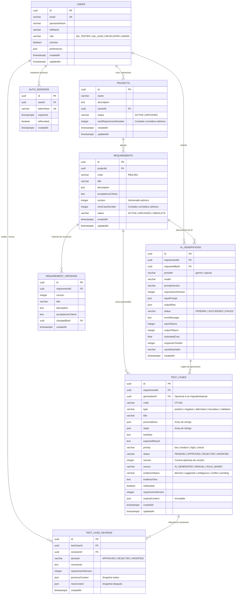

# Modelo de Datos y Esquema Relacional — TestGenAI MVP Real

**Motor de Base de Datos:** PostgreSQL 15+ / 16  
**ORM:** Prisma ORM  
**Versión del Esquema:** 1.0 (Consolidado MVP)  
**Fecha:** Octubre 2026  

---

## 1. Diagrama Entidad-Relación Consolidado

---

## 2. Invariantes del Modelo de Persistencia

1. **Unicidad de Códigos Secuenciales:**
   - `Requirement.code` es único por proyecto: `@@unique([projectId, code])`.
   - `TestCase.code` es único por requisito: `@@unique([requirementId, code])`.
   - La asignación de correlativos (`REQ-XXX`, `CP-XXX`) utiliza contadores reservados atómicamente (`nextRequirementNumber`, `nextCaseNumber`) mediante transacciones `SELECT ... FOR UPDATE` para evitar colisiones ante peticiones concurrentes.

2. **Tipos Nativos JSON:**
   - Se utiliza el tipo `Json` nativo de PostgreSQL para `preconditions`, `steps`, `originalContent`, `previousContent`, `newContent`, `inputPrompt` y `outputRaw`.
   - Se eliminaron las conversiones manuales ambiguas de cadenas de texto y delimitadores inconsistentes.

3. **Inmutabilidad y Procedencia:**
   - Todo caso generado por IA conserva su referencia a `AiGeneration` mediante `generationId`.
   - `originalContent` almacena la respuesta original generada por la IA y no se sobreescribe al editar el caso.
   - Cada edición o decisión de revisión genera un registro inmutable en `TestCaseReview` con snapshots completos del estado anterior y posterior.

4. **Versionado de Requisitos e Historial de Obsolescencia:**
   - Cada actualización significativa en título, descripción o criterios de aceptación incrementa `version` y crea un snapshot en `RequirementVersion`.
   - Los casos de prueba asociados a la versión anterior quedan marcados como `isObsolete = true`, requiriendo re-evaluación por parte del equipo QA.
